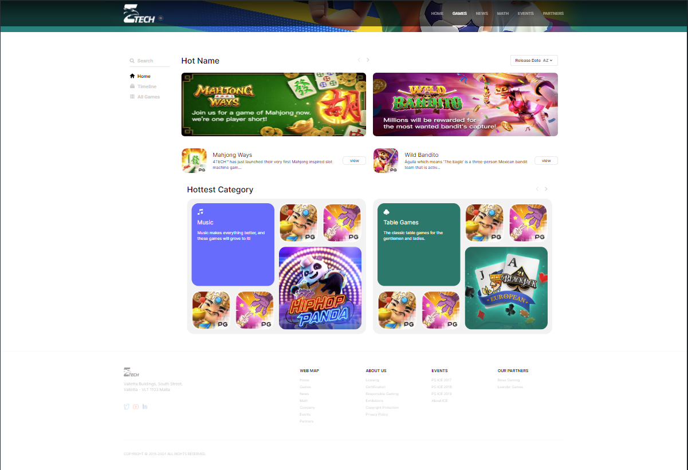
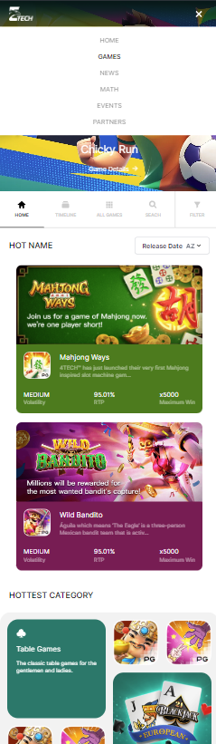

# Web Test Results

## Overview

This project includes a web test, demonstrating the functionality and responsiveness of the web page across both desktop and mobile views.

## Screenshots

Below are the screenshots showing the web page in both desktop and mobile views:

### Desktop View



### Mobile View




## Getting Started

Follow these steps to set up and run the project:

### 1. Clone the Repository

```bash
git clone https://github.com/Kynguyen-IT/test-NT.git

```

### 2. Navigate to the Project Directory

```bash
cd test-NT
```

### 3. Install Dependencies

```bash
npm install or yarn install 
```

### 3. Start the Development Server

```bash
npm run dev or yarn dev
```

### 4. Build the Project for Production


```bash
npm run build or yarn build
```

